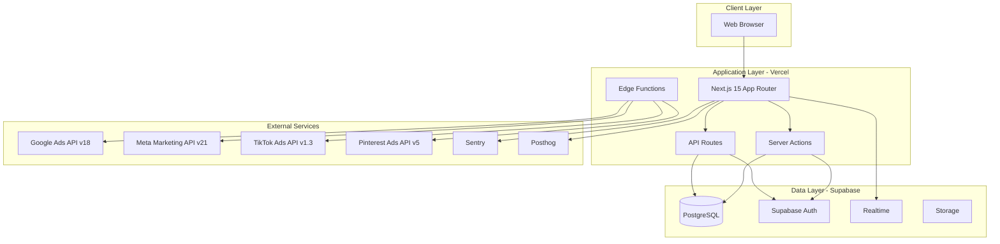

# Design Document: AdsPulse Dashboard

## Overview

AdsPulse, dijital pazarlamacıların birden fazla reklam platformunu (Google Ads, Meta Ads, TikTok Ads, Pinterest Ads) tek bir merkezi arayüzden yönetmelerine olanak tanıyan SaaS tabanlı bir reklam yönetim platformudur.

### System Goals

- Birden fazla reklam platformunun verilerini merkezi bir arayüzde birleştirmek
- Gerçek zamanlı kampanya yönetimi ve performans takibi sağlamak
- Organizasyon bazlı çok kullanıcılı işbirliği ortamı sunmak
- Güvenli, ölçeklenebilir ve performanslı bir mimari sağlamak

### Key Features

- Multi-platform OAuth entegrasyonu (Google, Meta, TikTok, Pinterest)
- Otomatik veri senkronizasyonu (15 dakikada bir)
- Gerçek zamanlı dashboard ve metrik görselleştirme
- Kampanya durum ve bütçe yönetimi
- Rol tabanlı erişim kontrolü (RBAC)
- Organizasyon ve ekip yönetimi
- Rapor oluşturma ve dışa aktarma (CSV, Excel, PDF)
- Row-level security (RLS) ile veri izolasyonu

## Architecture

### High-Level Architecture



### Architecture Patterns

**Frontend Architecture:**
- Server-Side Rendering (SSR) ile ilk sayfa yüklemesi
- Client-Side Rendering (CSR) ile dinamik güncellemeler
- React Server Components (RSC) ile veri çekme
- TanStack Query ile client-side cache yönetimi
- Zustand ile global state yönetimi
- Optimistic updates ile kullanıcı deneyimi iyileştirme

**Backend Architecture:**
- API Routes: RESTful endpoints (OAuth callbacks, webhook handlers)
- Server Actions: Form submissions ve mutations
- Edge Functions: Ad platform API çağrıları ve data sync
- Supabase RLS: Database-level security
- Supabase Realtime: Live data updates

**Data Sync Architecture:**
- Scheduled Edge Functions (15 dakikada bir)
- Queue-based processing (rate limiting için)
- Incremental sync (sadece değişen veriler)
- Error handling ve retry logic
- Sync status tracking


## Components and Interfaces

### Frontend Components

#### Page Components

**DashboardPage** (`app/dashboard/page.tsx`)
- Server Component
- Fetches initial dashboard data
- Renders metric cards, charts, filters
- Props: searchParams (date range, platform filters)

**CampaignsPage** (`app/campaigns/page.tsx`)
- Server Component
- Fetches paginated campaign list
- Renders TanStack Table with filters
- Props: searchParams (page, filters, sort)

**CampaignDetailPage** (`app/campaigns/[id]/page.tsx`)
- Server Component
- Fetches campaign details and metrics
- Renders detail view with charts
- Props: params.id, searchParams (date range)

**ReportsPage** (`app/reports/page.tsx`)
- Client Component
- Interactive report builder
- Export functionality

**SettingsPage** (`app/settings/page.tsx`)
- Tabs: Profile, Organization, Members, Ad Accounts
- Role-based rendering

#### UI Components (shadcn/ui based)

**MetricCard**
```typescript
interface MetricCardProps {
  title: string;
  value: number | string;
  change?: number; // percentage change
  format: 'currency' | 'number' | 'percentage';
  loading?: boolean;
}
```

**CampaignTable**
```typescript
interface CampaignTableProps {
  campaigns: Campaign[];
  onStatusChange: (id: string, status: CampaignStatus) => Promise<void>;
  onBudgetChange: (id: string, budget: number) => Promise<void>;
  onBulkAction: (ids: string[], action: BulkAction) => Promise<void>;
  loading?: boolean;
}
```

**DateRangePicker**
```typescript
interface DateRangePickerProps {
  value: { from: Date; to: Date };
  onChange: (range: { from: Date; to: Date }) => void;
  presets: DateRangePreset[];
  maxDays?: number;
}
```


**PlatformFilter**
```typescript
interface PlatformFilterProps {
  selected: AdPlatform[];
  onChange: (platforms: AdPlatform[]) => void;
  availablePlatforms: AdPlatform[];
}
```

**ChartContainer**
```typescript
interface ChartContainerProps {
  type: 'line' | 'bar' | 'pie' | 'area';
  data: ChartData[];
  xKey: string;
  yKeys: string[];
  loading?: boolean;
}
```

#### Feature Components

**OAuthConnector**
```typescript
interface OAuthConnectorProps {
  platform: AdPlatform;
  onSuccess: (accountId: string) => void;
  onError: (error: Error) => void;
}
```

**SyncStatusIndicator**
```typescript
interface SyncStatusIndicatorProps {
  accountId: string;
  lastSyncAt?: Date;
  status: 'syncing' | 'success' | 'error' | 'idle';
  onManualSync: () => Promise<void>;
}
```

**RoleGuard**
```typescript
interface RoleGuardProps {
  requiredRole: Role;
  children: React.ReactNode;
  fallback?: React.ReactNode;
}
```

### Backend Interfaces

#### API Routes

**OAuth Callback** (`/api/oauth/[platform]/callback`)
```typescript
// GET /api/oauth/google/callback?code=xxx&state=xxx
interface OAuthCallbackRequest {
  code: string;
  state: string;
}

interface OAuthCallbackResponse {
  success: boolean;
  accountId?: string;
  error?: string;
}
```


**Webhook Handler** (`/api/webhooks/[platform]`)
```typescript
// POST /api/webhooks/google
interface WebhookRequest {
  event: string;
  data: Record<string, any>;
  signature: string;
}

interface WebhookResponse {
  received: boolean;
}
```

**Export Handler** (`/api/reports/export`)
```typescript
// POST /api/reports/export
interface ExportRequest {
  format: 'csv' | 'excel' | 'pdf';
  dateRange: { from: string; to: string };
  platforms?: AdPlatform[];
  campaignIds?: string[];
}

interface ExportResponse {
  url: string; // Signed URL for download
  expiresAt: string;
}
```

#### Server Actions

**updateCampaignStatus**
```typescript
async function updateCampaignStatus(
  campaignId: string,
  status: CampaignStatus
): Promise<{ success: boolean; error?: string }>;
```

**updateCampaignBudget**
```typescript
async function updateCampaignBudget(
  campaignId: string,
  budget: number
): Promise<{ success: boolean; error?: string }>;
```

**inviteOrgMember**
```typescript
async function inviteOrgMember(
  email: string,
  role: Role
): Promise<{ success: boolean; error?: string }>;
```

**triggerManualSync**
```typescript
async function triggerManualSync(
  accountId: string
): Promise<{ success: boolean; syncId?: string; error?: string }>;
```


#### Edge Functions

**syncAdPlatformData**
```typescript
interface SyncJobPayload {
  accountId: string;
  platform: AdPlatform;
  syncType: 'full' | 'incremental';
}

async function syncAdPlatformData(
  payload: SyncJobPayload
): Promise<SyncResult>;

interface SyncResult {
  success: boolean;
  recordsSynced: number;
  error?: string;
  nextSyncAt?: Date;
}
```

### Service Layer Interfaces

**AdPlatformService**
```typescript
interface AdPlatformService {
  // OAuth
  getAuthUrl(redirectUri: string, state: string): string;
  exchangeCodeForToken(code: string): Promise<OAuthTokens>;
  refreshToken(refreshToken: string): Promise<OAuthTokens>;
  
  // Campaign Management
  getCampaigns(accountId: string): Promise<Campaign[]>;
  updateCampaignStatus(campaignId: string, status: CampaignStatus): Promise<void>;
  updateCampaignBudget(campaignId: string, budget: number): Promise<void>;
  
  // Metrics
  getCampaignMetrics(
    campaignId: string,
    dateRange: DateRange
  ): Promise<Metric[]>;
}
```

**NotificationService**
```typescript
interface NotificationService {
  sendEmail(to: string, template: EmailTemplate, data: any): Promise<void>;
  sendInvitation(email: string, orgId: string, role: Role): Promise<void>;
  sendTokenRefreshFailure(userId: string, platform: AdPlatform): Promise<void>;
  sendBudgetAlert(userId: string, campaignId: string): Promise<void>;
}
```


**RateLimitService**
```typescript
interface RateLimitService {
  checkLimit(platform: AdPlatform, operation: string): Promise<boolean>;
  recordRequest(platform: AdPlatform, operation: string): Promise<void>;
  getWaitTime(platform: AdPlatform): Promise<number>; // milliseconds
}
```

## Data Models

### Core Entities

**User**
```typescript
interface User {
  id: string; // UUID
  email: string;
  displayName: string;
  avatarUrl?: string;
  createdAt: Date;
  updatedAt: Date;
}
```

**Organization**
```typescript
interface Organization {
  id: string; // UUID
  name: string;
  slug: string; // unique, URL-friendly
  plan: 'free' | 'pro' | 'enterprise';
  createdAt: Date;
  updatedAt: Date;
}
```

**OrgMember**
```typescript
interface OrgMember {
  id: string; // UUID
  orgId: string;
  userId: string;
  role: 'owner' | 'admin' | 'member' | 'viewer';
  createdAt: Date;
  
  // Relations
  user?: User;
  organization?: Organization;
}
```

**AdAccount**
```typescript
interface AdAccount {
  id: string; // UUID
  orgId: string;
  platform: 'google' | 'meta' | 'tiktok' | 'pinterest';
  accountId: string; // External platform account ID
  accountName: string;
  accessToken: string; // Encrypted
  refreshToken?: string; // Encrypted
  tokenExpiresAt?: Date;
  isActive: boolean;
  lastSyncedAt?: Date;
  createdAt: Date;
  updatedAt: Date;
  
  // Relations
  organization?: Organization;
  campaigns?: Campaign[];
}
```


**Campaign**
```typescript
interface Campaign {
  id: string; // UUID
  orgId: string;
  accountId: string;
  platform: 'google' | 'meta' | 'tiktok' | 'pinterest';
  externalId: string; // Platform's campaign ID
  name: string;
  status: 'active' | 'paused' | 'archived' | 'deleted';
  objective?: string;
  budget?: number;
  budgetType?: 'daily' | 'lifetime';
  startDate?: Date;
  endDate?: Date;
  createdAt: Date;
  updatedAt: Date;
  
  // Relations
  organization?: Organization;
  account?: AdAccount;
  metrics?: CampaignMetric[];
}
```

**CampaignMetric**
```typescript
interface CampaignMetric {
  id: string; // UUID
  campaignId: string;
  orgId: string;
  platform: 'google' | 'meta' | 'tiktok' | 'pinterest';
  date: Date; // Daily aggregation
  impressions: number;
  clicks: number;
  spend: number; // in cents
  conversions: number;
  revenue?: number; // in cents
  ctr?: number; // Click-through rate
  cpc?: number; // Cost per click (in cents)
  roas?: number; // Return on ad spend
  createdAt: Date;
  
  // Relations
  campaign?: Campaign;
}
```

**HourlyMetric**
```typescript
interface HourlyMetric {
  id: string; // UUID
  orgId: string;
  platform: 'google' | 'meta' | 'tiktok' | 'pinterest';
  date: Date;
  hour: number; // 0-23
  impressions: number;
  clicks: number;
  spend: number; // in cents
  conversions: number;
  createdAt: Date;
}
```


**SyncLog**
```typescript
interface SyncLog {
  id: string; // UUID
  orgId: string;
  accountId: string;
  status: 'in_progress' | 'completed' | 'failed';
  recordsSynced?: number;
  errorMessage?: string;
  startedAt: Date;
  finishedAt?: Date;
  
  // Relations
  account?: AdAccount;
}
```

**Invitation**
```typescript
interface Invitation {
  id: string; // UUID
  orgId: string;
  email: string;
  role: 'admin' | 'member' | 'viewer';
  token: string; // Unique token for acceptance
  status: 'pending' | 'accepted' | 'expired';
  expiresAt: Date;
  invitedBy: string; // User ID
  createdAt: Date;
  acceptedAt?: Date;
  
  // Relations
  organization?: Organization;
  inviter?: User;
}
```

### Database Schema

**RLS Policies:**

All tables have organization-based RLS policies:

```sql
-- Example for campaigns table
CREATE POLICY "Users can view campaigns in their org"
  ON campaigns FOR SELECT
  USING (
    org_id IN (
      SELECT org_id FROM org_members 
      WHERE user_id = auth.uid()
    )
  );

CREATE POLICY "Members can update campaigns in their org"
  ON campaigns FOR UPDATE
  USING (
    org_id IN (
      SELECT org_id FROM org_members 
      WHERE user_id = auth.uid() 
      AND role IN ('owner', 'admin', 'member')
    )
  );
```


**Indexes:**

```sql
-- Performance indexes
CREATE INDEX idx_campaigns_org_id ON campaigns(org_id);
CREATE INDEX idx_campaigns_account_id ON campaigns(account_id);
CREATE INDEX idx_campaigns_status ON campaigns(status);
CREATE INDEX idx_campaign_metrics_campaign_id ON campaign_metrics(campaign_id);
CREATE INDEX idx_campaign_metrics_date ON campaign_metrics(date);
CREATE INDEX idx_campaign_metrics_org_date ON campaign_metrics(org_id, date);
CREATE INDEX idx_hourly_metrics_org_date ON hourly_metrics(org_id, date, hour);
CREATE INDEX idx_sync_logs_account_id ON sync_logs(account_id);
CREATE INDEX idx_sync_logs_started_at ON sync_logs(started_at);
```

### Type Definitions

**Enums:**
```typescript
type AdPlatform = 'google' | 'meta' | 'tiktok' | 'pinterest';
type CampaignStatus = 'active' | 'paused' | 'archived' | 'deleted';
type Role = 'owner' | 'admin' | 'member' | 'viewer';
type SyncStatus = 'in_progress' | 'completed' | 'failed';
type ExportFormat = 'csv' | 'excel' | 'pdf';
type DateRangePreset = 'today' | 'yesterday' | 'last7days' | 'last30days' | 'custom';
```

**Utility Types:**
```typescript
interface DateRange {
  from: Date;
  to: Date;
}

interface OAuthTokens {
  accessToken: string;
  refreshToken?: string;
  expiresAt?: Date;
}

interface DashboardMetrics {
  totalSpend: number;
  totalImpressions: number;
  totalClicks: number;
  totalConversions: number;
  avgCtr: number;
  avgCpa: number;
}

interface ChartData {
  date: string;
  [key: string]: string | number;
}
```

